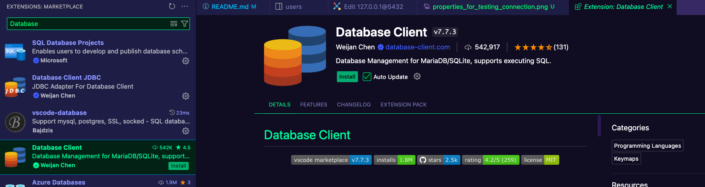
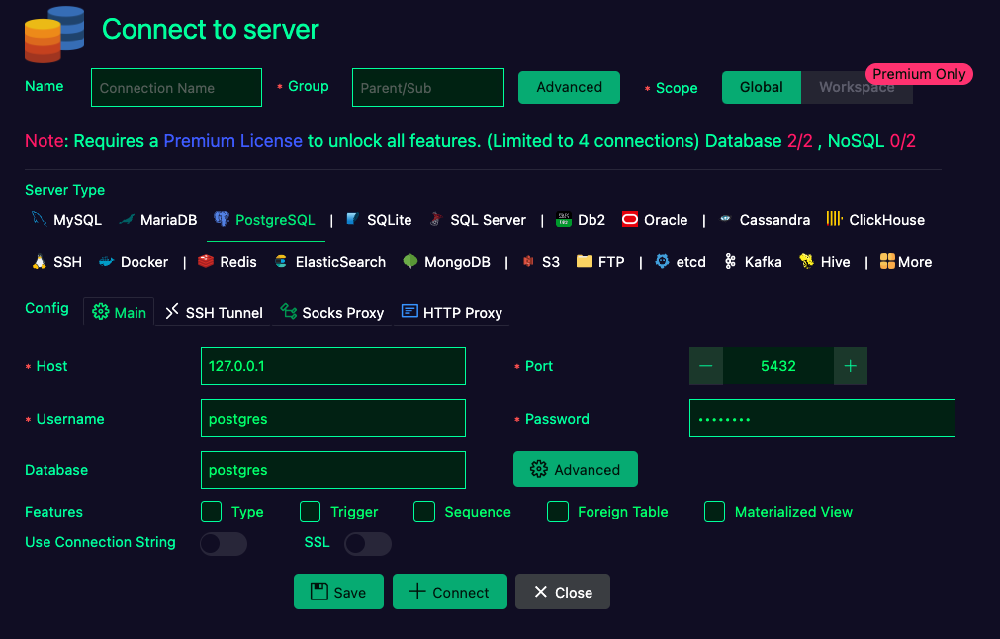
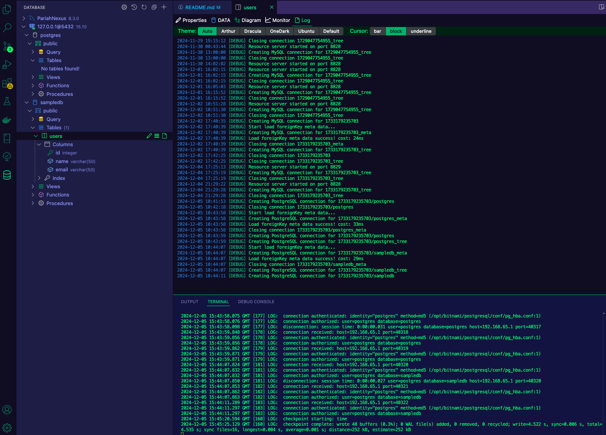

**Here is the screenshot of where the extension is**

**Here is an example of the properties for connecting to your running container of postgres**

**Here's an example of what the logs look like when you're connecting and your container is set to log dis/connections, both by using `docker logs` as well as the extension**
